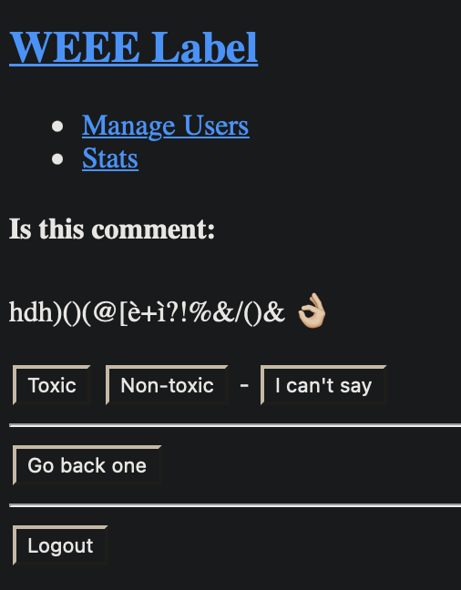
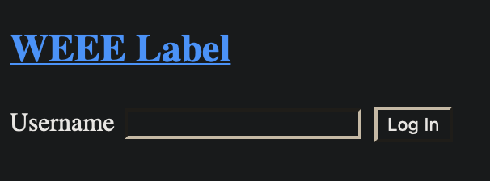

# WEEE Label

A bad website for a good purpose
<hr />
A Flask backend + pure HTML frontend to allow people to easily help with binary dataset labeling



### How it works

User with ID=1 is admin and can add and remove users at `/manageusers`.  

All signed-in users can label a data point at `/` by clicking on a button, until their share of data entries to label is completed.  
Their share is computed as the range of data points from 
```python
dataset_lower_limit = int(dataset_len * (user_id - 1) * user_to_label_ratio)
``` 
up to 
```python
dataset_upper_limit = int(dataset_len * user_id * user_to_label_ratio)
```
where
```python
user_to_label_ratio = 1 / users_count
```
meaning if there are 100 users, the dataset length is 1000, and my user ID is 20, I will have to label the `[190, 199]` entries data range.




### How to run

1. `python -m venv venv`
2. `source venv/bin/activate`
3. `pip install -r requirements.txt`
4. `FLASK_APP=app.py FLASK_ENV=development flask run`
5. `FLASK_APP=app.py FLASK_ENV=development flask init-db` (first time only)
6. `FLASK_APP=app.py FLASK_ENV=development flask run` again (first time only)

### How to deploy

1. Edit `schema.sql` so that the admin user has a different username than "replace_me_with_secret_admin_username"
2. Edit the app's `SECRET_KEY` in the first lines of `app.py`
3. `docker-compose up -d`
4. Configure a reverse proxy to forward port 80 (or change the port in `docker-compose.yml`)
5. Domain, DNS and TLS certificates are up to you 😏
